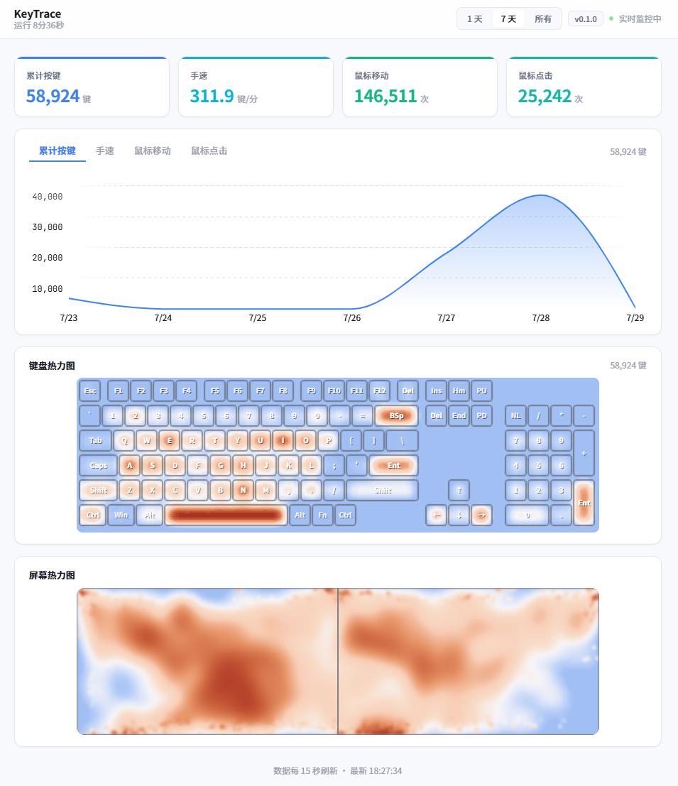

# KeyTrace

> 一句话：记录你的键盘和鼠标活动，生成热力图和趋势报告。

后台运行、不打扰、纯本地。双击 exe 即可，无需安装。数据存 `%LOCALAPPDATA%`，换位置不丢失。



## ✨ 功能

## 🚀 使用

1. 下载 `keytrace.exe`（单文件，无需安装）
2. 双击运行，系统托盘出现图标
3. 右键托盘图标 → "打开 Dashboard"，浏览器自动打开 `http://localhost:50555`
4. 数据每 15 秒自动刷新

数据库自动创建在 `%LOCALAPPDATA%/KeyTrace/`，换位置不影响历史数据。

## 🔧 开发

```bash
# 前端
cd frontend
npm install
npm run dev          # Vite 热更新，访问 http://127.0.0.1:5520

# 后端
cargo build          # Debug 编译
cargo build --release  # Release 编译（单文件 exe）

# 发布
cd frontend && npm run build    # 构建前端 dist
cargo build --release            # 编译嵌入前端的单文件 exe
```

## 🏗️ 技术栈

| 层 | 技术 |
|----|------|
| 后端 | Rust + tiny_http + rusqlite |
| 前端 | React + Vite + Tailwind CSS + Motion |
| 钩子 | Windows WH_KEYBOARD_LL / WH_MOUSE_LL |
| 图表 | 自绘 Canvas (Jet colormap) |
| 嵌入 | rust-embed (前端静态文件嵌入 exe) |

## 📁 项目结构

```
src/            Rust 后端
  main.rs        入口、单实例锁、线程管理
  hooks.rs       Windows 低级键盘/鼠标钩子
  processor.rs   事件处理、内存缓冲区、批量写入
  db.rs          SQLite 数据库操作
  api.rs         HTTP API 服务器 + 嵌入前端
  tray.rs        系统托盘图标
  screens.rs     屏幕信息枚举
  session.rs     活跃会话检测
  config.rs      默认配置
  static_files.rs 前端嵌入（rust-embed）

frontend/       React 前端
  src/components/  热力图、趋势图等组件
```

## 📄 许可

MIT
